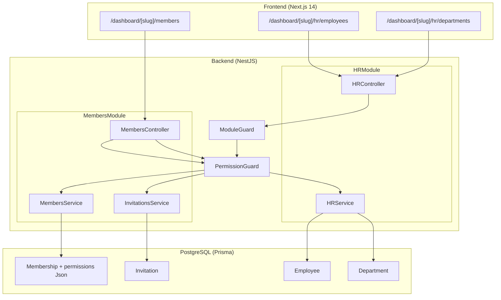

# Document de Design — Gestion d'Entreprise (Company Management)

## Overview

Le module **Company Management** étend la plateforme Sorika avec deux fonctionnalités majeures :

1. **Gestion des membres** : invitation par email, attribution de rôles (`OWNER`, `ADMIN`, `STAFF`), permissions granulaires par module, retrait de membres.
2. **Module RH** : gestion des fiches employés et des départements, indépendamment des comptes utilisateurs Sorika.

### Contexte technique

- **Backend** : NestJS 11 + Prisma 5 + PostgreSQL. Pas de JWT — l'authentification est gérée côté client via `localStorage`. Les requêtes backend s'appuient sur un header `x-user-id` et `x-company-id` injectés par le frontend.
- **Frontend** : Next.js 14 App Router, TypeScript, Tailwind CSS, shadcn/ui.
- **Multi-tenant** : toutes les données sont scopées à `companyId`. Le `Permission_Guard` vérifie systématiquement que le `companyId` de la requête correspond au `companyId` du membre authentifié.

### Décisions de design

| Décision | Choix | Rationale |
|---|---|---|
| Auth backend | Headers `x-user-id` + `x-company-id` | Cohérent avec l'architecture existante sans JWT |
| Permissions | JSON `{ "MODULE": ["ACTION"] }` dans `Membership` | Flexible, extensible, requêtes simples |
| Invitations | Token UUID + expiry 7j en base | Simple, pas de dépendance externe |
| Email | Nodemailer (à configurer) | Standard NestJS, mockable en tests |
| PBT library | `fast-check` (TypeScript) | Mature, bien intégré à Jest |

---

## Architecture



### Flux d'authentification

Le frontend lit `localStorage.user` → extrait `{ user.id, companies[slug].id }` → injecte dans chaque requête HTTP les headers :
- `x-user-id: <userId>`
- `x-company-id: <companyId>`

Le `PermissionGuard` lit ces headers, vérifie le `Membership` en base, et contrôle les permissions.

---

## Components and Interfaces

### Interfaces TypeScript partagées (frontend)

```typescript
// types/members.ts
export type Role = 'OWNER' | 'ADMIN' | 'STAFF';
export type ModuleAction = 'READ' | 'CREATE' | 'UPDATE' | 'DELETE';
export type ModuleName = 'CRM' | 'HR' | 'LANDING_PAGE' | 'MEDIA' | 'ECOMMERCE' | 'ANALYTICS' | 'MESSAGING' | 'BLOG';

export interface Permissions {
  [module: string]: ModuleAction[];
}

export interface Member {
  id: string;           // membershipId
  userId: string;
  firstName: string | null;
  lastName: string | null;
  email: string;
  role: Role;
  permissions: Permissions;
  joinedAt: string;
}

export interface Invitation {
  id: string;
  email: string;
  role: Role;
  permissions: Permissions;
  expiresAt: string;
  createdAt: string;
}

export interface MembersListResponse {
  members: Member[];
  invitations: Invitation[];
}

// types/hr.ts
export type ContractType = 'CDI' | 'CDD' | 'FREELANCE' | 'STAGE' | 'ALTERNANCE';

export interface Department {
  id: string;
  name: string;
  description: string | null;
  companyId: string;
  _count?: { employees: number };
  createdAt: string;
}

export interface Employee {
  id: string;
  firstName: string;
  lastName: string;
  position: string;
  departmentId: string | null;
  department?: Department | null;
  contractType: ContractType | null;
  salary: number | null;
  hireDate: string;
  userId: string | null;
  companyId: string;
  createdAt: string;
  updatedAt: string;
}
```

### Backend — DTOs NestJS

```typescript
// members/dto/invite-member.dto.ts
export class InviteMemberDto {
  @IsEmail()
  email: string;

  @IsIn(['ADMIN', 'STAFF'])
  role: 'ADMIN' | 'STAFF';

  @IsObject()
  @IsOptional()
  permissions?: Record<string, string[]>;
}

// members/dto/update-member.dto.ts
export class UpdateMemberDto {
  @IsIn(['ADMIN', 'STAFF'])
  @IsOptional()
  role?: 'ADMIN' | 'STAFF';

  @IsObject()
  @IsOptional()
  permissions?: Record<string, string[]>;
}

// hr/dto/create-employee.dto.ts
export class CreateEmployeeDto {
  @IsString() @IsNotEmpty()
  firstName: string;

  @IsString() @IsNotEmpty()
  lastName: string;

  @IsString() @IsNotEmpty()
  position: string;

  @IsDateString()
  hireDate: string;

  @IsUUID() @IsOptional()
  departmentId?: string;

  @IsIn(['CDI','CDD','FREELANCE','STAGE','ALTERNANCE']) @IsOptional()
  contractType?: string;

  @IsNumber() @IsOptional()
  salary?: number;

  @IsUUID() @IsOptional()
  userId?: string;
}

// hr/dto/create-department.dto.ts
export class CreateDepartmentDto {
  @IsString() @IsNotEmpty()
  name: string;

  @IsString() @IsOptional()
  description?: string;
}
```

### Backend — Signatures des services

```typescript
// members/members.service.ts
export class MembersService {
  async listMembers(companyId: string): Promise<MembersListResponse>
  async updateMember(companyId: string, membershipId: string, dto: UpdateMemberDto, requesterId: string): Promise<Membership>
  async removeMember(companyId: string, membershipId: string, requesterId: string): Promise<void>
  async getDefaultPermissions(role: Role, modules: string[]): Promise<Permissions>
}

// members/invitations.service.ts
export class InvitationsService {
  async createInvitation(companyId: string, dto: InviteMemberDto, requesterId: string): Promise<Invitation>
  async acceptInvitation(token: string, userId: string): Promise<Membership>
  async cancelInvitation(companyId: string, invitationId: string, requesterId: string): Promise<void>
}

// hr/hr.service.ts
export class HRService {
  // Employees
  async listEmployees(companyId: string): Promise<Employee[]>
  async createEmployee(companyId: string, dto: CreateEmployeeDto): Promise<Employee>
  async updateEmployee(companyId: string, employeeId: string, dto: UpdateEmployeeDto): Promise<Employee>
  async deleteEmployee(companyId: string, employeeId: string): Promise<void>
  async linkEmployeeToUser(companyId: string, employeeId: string, userId: string): Promise<Employee>

  // Departments
  async listDepartments(companyId: string): Promise<Department[]>
  async createDepartment(companyId: string, dto: CreateDepartmentDto): Promise<Department>
  async updateDepartment(companyId: string, departmentId: string, dto: UpdateDepartmentDto): Promise<Department>
  async deleteDepartment(companyId: string, departmentId: string): Promise<void>
}
```

### Backend — Endpoints complets

#### MembersController — `/companies/:companyId/members`

| Méthode | Route | Description | Permission requise |
|---|---|---|---|
| `GET` | `/companies/:companyId/members` | Liste membres + invitations | Tout membre |
| `POST` | `/companies/:companyId/members/invite` | Créer une invitation | `OWNER` ou `ADMIN` |
| `PATCH` | `/companies/:companyId/members/:membershipId` | Modifier rôle/permissions | `OWNER` uniquement |
| `DELETE` | `/companies/:companyId/members/:membershipId` | Retirer un membre | `OWNER` ou `ADMIN` (STAFF seulement) |
| `DELETE` | `/companies/:companyId/members/invitations/:invitationId` | Annuler une invitation | `OWNER` ou `ADMIN` |
| `POST` | `/invitations/:token/accept` | Accepter une invitation | Public (token valide) |

#### HRController — `/companies/:companyId/hr`

| Méthode | Route | Description | Permission requise |
|---|---|---|---|
| `GET` | `/companies/:companyId/hr/employees` | Liste employés | `HR:READ` |
| `POST` | `/companies/:companyId/hr/employees` | Créer employé | `HR:CREATE` |
| `PATCH` | `/companies/:companyId/hr/employees/:id` | Modifier employé | `HR:UPDATE` |
| `DELETE` | `/companies/:companyId/hr/employees/:id` | Supprimer employé | `HR:DELETE` |
| `PATCH` | `/companies/:companyId/hr/employees/:id/link-user` | Lier à un User | `OWNER` |
| `GET` | `/companies/:companyId/hr/departments` | Liste départements | `HR:READ` |
| `POST` | `/companies/:companyId/hr/departments` | Créer département | `HR:CREATE` |
| `PATCH` | `/companies/:companyId/hr/departments/:id` | Modifier département | `HR:UPDATE` |
| `DELETE` | `/companies/:companyId/hr/departments/:id` | Supprimer département | `HR:DELETE` |

### Frontend — Fichiers à créer

```
frontend/
├── app/dashboard/[slug]/
│   ├── members/
│   │   └── page.tsx                    # Page gestion membres
│   └── hr/
│       ├── employees/
│       │   └── page.tsx                # Page employés
│       └── departments/
│           └── page.tsx                # Page départements
├── components/members/
│   ├── MembersList.tsx                 # Table des membres
│   ├── InvitationsList.tsx             # Table des invitations en attente
│   ├── InviteMemberDialog.tsx          # Modale invitation
│   └── EditPermissionsDialog.tsx       # Modale permissions
├── components/hr/
│   ├── EmployeesList.tsx               # Table des employés
│   ├── EmployeeFormDialog.tsx          # Modale création/édition employé
│   ├── DepartmentsList.tsx             # Table des départements
│   └── DepartmentFormDialog.tsx        # Modale création/édition département
├── hooks/
│   ├── useMembers.ts                   # Fetch + mutations membres
│   └── useHR.ts                        # Fetch + mutations HR
└── lib/
    └── api.ts                          # Client HTTP avec headers auth
```

---

## Data Models

### Extensions du schéma Prisma

```prisma
// Membership — ajout du champ permissions
model Membership {
  id          String   @id @default(uuid())
  role        String   @default("OWNER")   // OWNER | ADMIN | STAFF
  permissions Json     @default("{}")       // { "CRM": ["READ","CREATE"], "HR": ["READ"] }
  userId      String
  companyId   String
  user        User     @relation(fields: [userId], references: [id])
  company     Company  @relation(fields: [companyId], references: [id])
  createdAt   DateTime @default(now())

  @@unique([userId, companyId])
}

// Invitation — nouveau modèle
model Invitation {
  id          String    @id @default(uuid())
  email       String
  token       String    @unique @default(uuid())
  role        String    @default("STAFF")   // ADMIN | STAFF
  permissions Json      @default("{}")
  companyId   String
  company     Company   @relation(fields: [companyId], references: [id], onDelete: Cascade)
  expiresAt   DateTime
  usedAt      DateTime?
  createdAt   DateTime  @default(now())

  @@index([token])
  @@index([companyId])
}

// Department — nouveau modèle
model Department {
  id          String     @id @default(uuid())
  name        String
  description String?
  companyId   String
  company     Company    @relation(fields: [companyId], references: [id], onDelete: Cascade)
  employees   Employee[]
  createdAt   DateTime   @default(now())

  @@unique([companyId, name])
  @@index([companyId])
}

// Employee — nouveau modèle
model Employee {
  id           String      @id @default(uuid())
  firstName    String
  lastName     String
  position     String
  contractType String?     // CDI | CDD | FREELANCE | STAGE | ALTERNANCE
  salary       Float?
  hireDate     DateTime
  departmentId String?
  department   Department? @relation(fields: [departmentId], references: [id])
  companyId    String
  company      Company     @relation(fields: [companyId], references: [id], onDelete: Cascade)
  userId       String?     @unique  // Lien optionnel vers un User Sorika (unique par company géré en service)
  user         User?       @relation(fields: [userId], references: [id])
  createdAt    DateTime    @default(now())
  updatedAt    DateTime    @updatedAt

  @@index([companyId])
  @@index([departmentId])
}
```

### Ajouts sur les modèles existants

```prisma
// Company — ajout des relations
model Company {
  // ... champs existants ...
  invitations  Invitation[]
  departments  Department[]
  employees    Employee[]
}

// User — ajout de la relation Employee
model User {
  // ... champs existants ...
  employees    Employee[]
}
```

### Permissions par défaut par rôle

```typescript
const DEFAULT_PERMISSIONS: Record<Role, (modules: string[]) => Permissions> = {
  OWNER: (modules) => Object.fromEntries(
    modules.map(m => [m, ['READ', 'CREATE', 'UPDATE', 'DELETE']])
  ),
  ADMIN: (modules) => Object.fromEntries(
    modules.map(m => [m, ['READ', 'CREATE']])
  ),
  STAFF: (modules) => Object.fromEntries(
    modules.map(m => [m, ['READ']])
  ),
};
```

---

## Correctness Properties

*A property is a characteristic or behavior that should hold true across all valid executions of a system — essentially, a formal statement about what the system should do. Properties serve as the bridge between human-readable specifications and machine-verifiable correctness guarantees.*

### Property 1 : Invitation token unicité et expiry

*For any* ensemble d'invitations créées avec des emails et rôles valides, chaque invitation doit avoir un token distinct et une date d'expiration égale à `createdAt + 7 jours`.

**Validates: Requirements 1.1**

### Property 2 : Acceptation d'invitation — round-trip rôle/permissions

*For any* invitation valide avec un rôle et des permissions arbitraires, accepter cette invitation doit créer un `Membership` dont le rôle et les permissions sont identiques à ceux définis dans l'invitation.

**Validates: Requirements 1.5**

### Property 3 : Rejet des invitations invalides (expirées ou utilisées)

*For any* invitation dont `expiresAt < now` ou `usedAt != null`, tenter de l'accepter doit retourner une erreur et laisser l'invitation inchangée.

**Validates: Requirements 1.6**

### Property 4 : Unicité OWNER — invariant permanent

*For any* séquence d'opérations sur les membres d'une `Company` (ajout, modification de rôle, retrait), le nombre de membres avec le rôle `OWNER` doit rester exactement égal à 1.

**Validates: Requirements 2.5**

### Property 5 : Mise à jour de rôle — reset des permissions

*For any* membre dont le rôle est modifié vers un nouveau rôle valide, ses permissions après modification doivent correspondre exactement aux permissions par défaut du nouveau rôle pour les modules actifs de la `Company`.

**Validates: Requirements 2.6**

### Property 6 : Permission Guard — décision correcte

*For any* combinaison de `Membership` (avec permissions arbitraires) et de paire `(module, action)`, le `PermissionGuard` doit autoriser la requête si et seulement si `permissions[module]` contient `action`.

**Validates: Requirements 3.4, 3.5**

### Property 7 : Isolation multi-tenant — membres

*For any* requête sur `/companies/:companyId/members` avec un `x-company-id` différent du `companyId` de l'URL, le service doit retourner une erreur HTTP 403.

**Validates: Requirements 9.1, 9.3**

### Property 8 : Isolation multi-tenant — HR

*For any* requête sur `/companies/:companyId/hr/*` avec un `x-company-id` différent du `companyId` de l'URL, le service doit retourner une erreur HTTP 403.

**Validates: Requirements 9.2, 6.6, 6.7**

### Property 9 : Validation des champs obligatoires Employee

*For any* sous-ensemble des champs obligatoires (`firstName`, `lastName`, `position`, `hireDate`) qui est absent ou vide lors de la création d'un `Employee`, le service doit retourner une erreur de validation listant exactement les champs manquants.

**Validates: Requirements 6.3**

### Property 10 : Unicité du nom de département par Company

*For any* `Company`, tenter de créer deux `Department`s avec le même nom doit retourner une erreur sur le second appel, tandis que le même nom dans une `Company` différente doit être accepté.

**Validates: Requirements 7.3**

### Property 11 : Suppression de département bloquée si employés actifs

*For any* `Department` contenant N > 0 employés, tenter de le supprimer doit retourner une erreur mentionnant N. Un département avec 0 employés doit pouvoir être supprimé.

**Validates: Requirements 7.4, 7.5**

### Property 12 : Unicité du lien User-Employee par Company

*For any* `User` déjà lié à un `Employee` dans une `Company`, tenter de le lier à un second `Employee` dans la même `Company` doit retourner une erreur.

**Validates: Requirements 8.4**

---

## Error Handling

### Codes HTTP utilisés

| Situation | Code HTTP | Message type |
|---|---|---|
| Ressource non trouvée (mauvais companyId) | `404 Not Found` | `"Ressource introuvable"` |
| Permission insuffisante | `403 Forbidden` | `"Permission [MODULE:ACTION] requise"` |
| Authentification manquante | `401 Unauthorized` | `"Authentification requise"` |
| Conflit (doublon, déjà membre) | `409 Conflict` | `"[Raison du conflit]"` |
| Validation échouée | `400 Bad Request` | `{ fields: ["firstName", ...] }` |
| Opération interdite (retirer OWNER) | `403 Forbidden` | `"L'OWNER ne peut pas être retiré"` |

### Stratégie d'erreur par couche

**Guard layer** (`PermissionGuard`, `ModuleGuard`) :
- Lit les headers `x-user-id` et `x-company-id`
- Si absents → `401 Unauthorized`
- Si `companyId` ne correspond pas au membership → `403 Forbidden` + log
- Si module non activé → `403 Forbidden`
- Si permission manquante → `403 Forbidden` avec message `"Permission HR:CREATE requise"`

**Service layer** :
- Toutes les opérations vérifient `companyId` en premier
- Les erreurs métier utilisent les exceptions NestJS (`BadRequestException`, `ConflictException`, `ForbiddenException`, `NotFoundException`)
- Les transactions Prisma garantissent l'atomicité (ex : acceptation d'invitation = créer Membership + marquer invitation usedAt)

**Frontend** :
- Toutes les erreurs API sont catchées et affichées via `toast.error()` (sonner)
- Les formulaires utilisent `react-hook-form` + `zod` pour la validation côté client avant envoi

### PermissionGuard — implémentation

```typescript
// common/guards/permission.guard.ts
export const RequirePermission = (module: string, action: string) =>
  SetMetadata('requiredPermission', { module, action });

@Injectable()
export class PermissionGuard implements CanActivate {
  async canActivate(context: ExecutionContext): Promise<boolean> {
    const request = context.switchToHttp().getRequest();
    const userId = request.headers['x-user-id'];
    const companyId = request.params.companyId;

    if (!userId || !companyId) throw new UnauthorizedException('Authentification requise');

    const membership = await this.prisma.membership.findUnique({
      where: { userId_companyId: { userId, companyId } },
    });

    if (!membership) throw new ForbiddenException('Accès refusé');

    // Vérification cross-tenant
    const headerCompanyId = request.headers['x-company-id'];
    if (headerCompanyId && headerCompanyId !== companyId) {
      this.logger.warn(`Cross-tenant attempt: user ${userId} → company ${companyId}`);
      throw new ForbiddenException('Accès refusé');
    }

    const required = this.reflector.get<{ module: string; action: string }>(
      'requiredPermission', context.getHandler()
    );
    if (!required) return true;

    const permissions = membership.permissions as Record<string, string[]>;
    const allowed = permissions[required.module]?.includes(required.action) ?? false;
    if (!allowed) throw new ForbiddenException(`Permission ${required.module}:${required.action} requise`);

    request.membership = membership;
    return true;
  }
}
```

---

## Testing Strategy

### Approche duale

Le module utilise une combinaison de tests unitaires (exemples concrets) et de tests basés sur les propriétés (property-based testing) pour une couverture complète.

**Library PBT** : `fast-check` (déjà compatible avec Jest/TypeScript)

```bash
npm install --save-dev fast-check
```

### Tests unitaires (exemples)

Couvrent les cas spécifiques non universels :
- Envoi d'email lors d'une invitation (mock nodemailer)
- Permissions par défaut pour chaque rôle (3 exemples fixes)
- Création d'un employé sans `userId`
- Log lors d'une tentative cross-tenant
- Inclusion des invitations en attente dans la liste des membres

### Tests property-based (fast-check)

Chaque propriété du design est implémentée avec un test `fc.assert(fc.asyncProperty(...))` configuré à **100 itérations minimum**.

Format de tag : `// Feature: company-management, Property N: <texte>`

```typescript
// Exemple — Property 4 : Unicité OWNER
// Feature: company-management, Property 4: owner count invariant
it('should always have exactly one OWNER after any member operation', async () => {
  await fc.assert(
    fc.asyncProperty(
      fc.array(memberOperationArbitrary, { minLength: 1, maxLength: 10 }),
      async (operations) => {
        const company = await createTestCompany();
        for (const op of operations) {
          await applyOperation(company.id, op).catch(() => {}); // ignore expected errors
        }
        const ownerCount = await prisma.membership.count({
          where: { companyId: company.id, role: 'OWNER' }
        });
        return ownerCount === 1;
      }
    ),
    { numRuns: 100 }
  );
});
```

### Organisation des fichiers de tests

```
backend/src/
├── members/
│   ├── members.service.spec.ts         # Tests unitaires + PBT service membres
│   └── invitations.service.spec.ts     # Tests unitaires + PBT invitations
├── hr/
│   └── hr.service.spec.ts              # Tests unitaires + PBT service RH
└── common/guards/
    └── permission.guard.spec.ts        # Tests PBT du guard
```

### Couverture par propriété

| Propriété | Type de test | Fichier |
|---|---|---|
| P1 — Token unicité + expiry | PBT | `invitations.service.spec.ts` |
| P2 — Round-trip invitation→membership | PBT | `invitations.service.spec.ts` |
| P3 — Rejet invitations invalides | PBT | `invitations.service.spec.ts` |
| P4 — Unicité OWNER | PBT | `members.service.spec.ts` |
| P5 — Reset permissions sur changement rôle | PBT | `members.service.spec.ts` |
| P6 — Permission Guard décision | PBT | `permission.guard.spec.ts` |
| P7 — Isolation tenant membres | PBT | `members.service.spec.ts` |
| P8 — Isolation tenant HR | PBT | `hr.service.spec.ts` |
| P9 — Validation champs Employee | PBT | `hr.service.spec.ts` |
| P10 — Unicité nom département | PBT | `hr.service.spec.ts` |
| P11 — Blocage suppression département | PBT | `hr.service.spec.ts` |
| P12 — Unicité lien User-Employee | PBT | `hr.service.spec.ts` |
